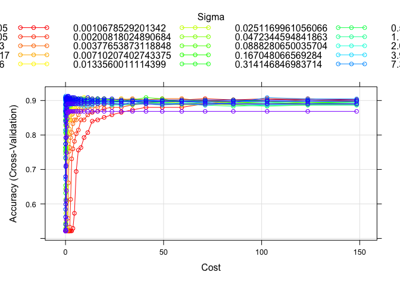
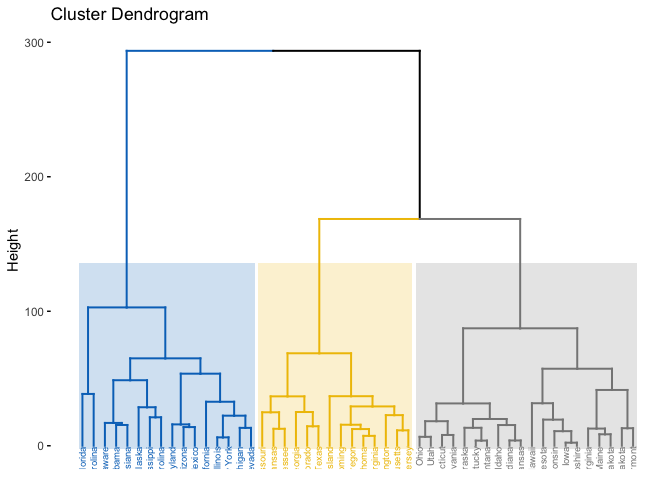
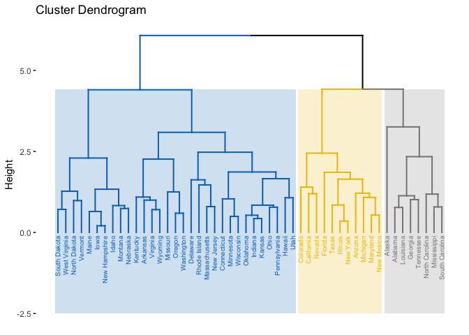
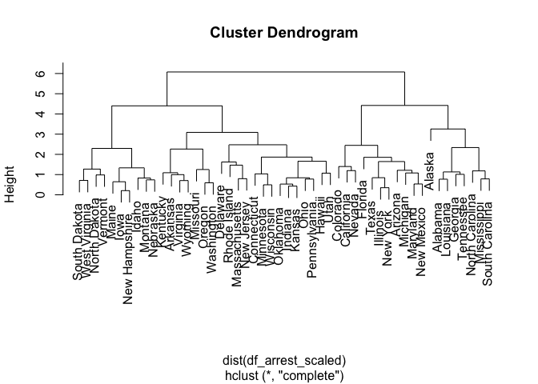

Homework5
================
Yuki Joyama
2024-04-28

# 1 Support Vector Machine

``` r
# read csv files 
df_auto = read_csv("./auto.csv") 
str(df_auto)
```

    ## spc_tbl_ [392 × 8] (S3: spec_tbl_df/tbl_df/tbl/data.frame)
    ##  $ cylinders   : num [1:392] 8 8 8 8 8 8 8 8 8 8 ...
    ##  $ displacement: num [1:392] 307 350 318 304 302 429 454 440 455 390 ...
    ##  $ horsepower  : num [1:392] 130 165 150 150 140 198 220 215 225 190 ...
    ##  $ weight      : num [1:392] 3504 3693 3436 3433 3449 ...
    ##  $ acceleration: num [1:392] 12 11.5 11 12 10.5 10 9 8.5 10 8.5 ...
    ##  $ year        : num [1:392] 70 70 70 70 70 70 70 70 70 70 ...
    ##  $ origin      : num [1:392] 1 1 1 1 1 1 1 1 1 1 ...
    ##  $ mpg_cat     : chr [1:392] "low" "low" "low" "low" ...
    ##  - attr(*, "spec")=
    ##   .. cols(
    ##   ..   cylinders = col_double(),
    ##   ..   displacement = col_double(),
    ##   ..   horsepower = col_double(),
    ##   ..   weight = col_double(),
    ##   ..   acceleration = col_double(),
    ##   ..   year = col_double(),
    ##   ..   origin = col_double(),
    ##   ..   mpg_cat = col_character()
    ##   .. )
    ##  - attr(*, "problems")=<externalptr>

``` r
# partition (training:test=70:30)
set.seed(100)
data_split = initial_split(df_auto, prop = .70)
train = training(data_split)
test = testing(data_split)
```

## a

Fit a support vector linear classifier to the training data

``` r
ctrl <- trainControl(method = "cv")

set.seed(100)

svml.fit <- train(
  mpg_cat ~ cylinders + displacement + horsepower + weight + acceleration + year + origin,
  data = train,
  method = "svmLinear",
  tuneGrid = data.frame(C = exp(seq(-4, 5, len = 50))),
  trControl = ctrl
)

plot(svml.fit, highlight = TRUE, xTrans = log)
```

<!-- -->

``` r
svml.fit$finalModel
```

    ## Support Vector Machine object of class "ksvm" 
    ## 
    ## SV type: C-svc  (classification) 
    ##  parameter : cost C = 0.0183156388887342 
    ## 
    ## Linear (vanilla) kernel function. 
    ## 
    ## Number of Support Vectors : 112 
    ## 
    ## Objective Function Value : -1.6605 
    ## Training error : 0.091241

I implemented the cross validation to determine the tuning parameter C.
In this case, the best parameter C was 0.018.  
The misclassification error rate using the training data is **0.0912**.

``` r
# test error
test.pred <- predict(svml.fit, newdata = test, type = "raw")

confusionMatrix(
  data = test.pred,
  reference = as.factor(test$mpg_cat)
)
```

    ## Confusion Matrix and Statistics
    ## 
    ##           Reference
    ## Prediction high low
    ##       high   50   6
    ##       low     3  59
    ##                                           
    ##                Accuracy : 0.9237          
    ##                  95% CI : (0.8601, 0.9645)
    ##     No Information Rate : 0.5508          
    ##     P-Value [Acc > NIR] : <2e-16          
    ##                                           
    ##                   Kappa : 0.8467          
    ##                                           
    ##  Mcnemar's Test P-Value : 0.505           
    ##                                           
    ##             Sensitivity : 0.9434          
    ##             Specificity : 0.9077          
    ##          Pos Pred Value : 0.8929          
    ##          Neg Pred Value : 0.9516          
    ##              Prevalence : 0.4492          
    ##          Detection Rate : 0.4237          
    ##    Detection Prevalence : 0.4746          
    ##       Balanced Accuracy : 0.9255          
    ##                                           
    ##        'Positive' Class : high            
    ## 

The test error rate is 1 - 0.9237 = **0.0763**

## b

Now, let’s fit a support vector machine with a radial kernel to the
training data

``` r
svmr.grid <- expand.grid(
  C = exp(seq(-4, 5, len = 50)),
  sigma = exp(seq(-10, 2, len = 20))
)

set.seed(100)

svmr.fit <- train(
  mpg_cat ~ cylinders + displacement + horsepower + weight + acceleration + year + origin,
  data = train,
  method = "svmRadialSigma",
  tuneGrid = svmr.grid,
  trControl = ctrl
)

svmr.fit$finalModel
```

    ## Support Vector Machine object of class "ksvm" 
    ## 
    ## SV type: C-svc  (classification) 
    ##  parameter : cost C = 0.0381852439339216 
    ## 
    ## Gaussian Radial Basis kernel function. 
    ##  Hyperparameter : sigma =  0.314146846983714 
    ## 
    ## Number of Support Vectors : 237 
    ## 
    ## Objective Function Value : -6.4103 
    ## Training error : 0.087591

``` r
myCol <- rainbow(25)
myPar <- list(
  superpose.symbol = list(col = myCol),
  superpose.line = list(col = myCol)
)

plot(svmr.fit, highlight = TRUE, par.settings = myPar)
```

<!-- -->

The best tuning parameters selected by the CV are C = 0.038 and sigma =
0.314.  
The training error rate is **0.0876**.

``` r
# test error
test.pred <- predict(svmr.fit, newdata = test, type = "raw")

confusionMatrix(
  data = test.pred,
  reference = as.factor(test$mpg_cat)
)
```

    ## Confusion Matrix and Statistics
    ## 
    ##           Reference
    ## Prediction high low
    ##       high   51   7
    ##       low     2  58
    ##                                           
    ##                Accuracy : 0.9237          
    ##                  95% CI : (0.8601, 0.9645)
    ##     No Information Rate : 0.5508          
    ##     P-Value [Acc > NIR] : <2e-16          
    ##                                           
    ##                   Kappa : 0.8472          
    ##                                           
    ##  Mcnemar's Test P-Value : 0.1824          
    ##                                           
    ##             Sensitivity : 0.9623          
    ##             Specificity : 0.8923          
    ##          Pos Pred Value : 0.8793          
    ##          Neg Pred Value : 0.9667          
    ##              Prevalence : 0.4492          
    ##          Detection Rate : 0.4322          
    ##    Detection Prevalence : 0.4915          
    ##       Balanced Accuracy : 0.9273          
    ##                                           
    ##        'Positive' Class : high            
    ## 

The test error rate is 1 - 0.9237 = **0.0763**

# 2 Hierarchical Clustering

``` r
# data prep
data("USArrests")

df_arrest = USArrests |> 
  janitor::clean_names()

str(df_arrest)
```

    ## 'data.frame':    50 obs. of  4 variables:
    ##  $ murder   : num  13.2 10 8.1 8.8 9 7.9 3.3 5.9 15.4 17.4 ...
    ##  $ assault  : int  236 263 294 190 276 204 110 238 335 211 ...
    ##  $ urban_pop: int  58 48 80 50 91 78 77 72 80 60 ...
    ##  $ rape     : num  21.2 44.5 31 19.5 40.6 38.7 11.1 15.8 31.9 25.8 ...

## a

Hierarchical clustering with complete linkage and Euclidean distance

``` r
hc.complete <- hclust(dist(df_arrest), method = "complete")

# dendrogram
fviz_dend(
  hc.complete, k = 3,
  cex = 0.5,
  palette = "jco",
  color_labels_by_k = TRUE,
  rect = TRUE, rect_fill = TRUE, rect_border = "jco",
  labels_track_height = 2
)
```

<!-- -->

States are clustered as follows:

Cluster 1 - Florida, North Carolina, Delaware, Alabama, Louisiana,
Alaska, Mississippi, South Carolina, Maryland, Arizona, New Mexico,
California, Illinois, New York, Michigan, Nevada  
Cluster 2 - Missouri, Arkansas, Tennessee, Georgia, Colorado, Texas,
Rhode Island, Wyoming, Oregon, Oklahoma, Virginia, Washington,
Massachusetts, New Jersey  
Cluster 3 - Ohio, Utah, Connecticut, Pennsylvania, Nebraska, Kentucky,
Montana, Idaho, Indiana, Kansas, Hawaii, Minnesota, Wisconsin, Iowa, New
Hampshire, West Virginia, Maine, South Dakota, North Dakota, Vermont

## b

I will scale the variables to have standard deviation one, then perform
the hierarchical clustering with complete linkage and Euclidean
distance.

``` r
df_arrest_scaled <- df_arrest |> 
  mutate(
    murder = scale(murder)[, 1],
    assault = scale(assault)[, 1],
    rape = scale(rape)[, 1],
    urban_pop = scale(urban_pop)[, 1]
  )

# check
sd(df_arrest_scaled$murder)
```

    ## [1] 1

``` r
sd(df_arrest_scaled$assault)
```

    ## [1] 1

``` r
sd(df_arrest_scaled$urban_pop)
```

    ## [1] 1

``` r
sd(df_arrest_scaled$rape)
```

    ## [1] 1

``` r
hc.complete <- hclust(dist(df_arrest_scaled), method = "complete")

# dendrogram
fviz_dend(
  hc.complete, k = 3,
  cex = 0.5,
  palette = "jco",
  color_labels_by_k = TRUE,
  rect = TRUE, rect_fill = TRUE, rect_border = "jco",
  labels_track_height = 2
)
```

<!-- -->

``` r
plot(hc.complete)
```

<!-- -->

Cluster 1 - South Dakota, West Virginia, North Dakota, Vermont, Maine,
Iowa, New Hampshire, Idaho, Montana, Nebraska, Kentucky, Arkansas,
Virginia, Wyoming, Missouri, Oregon, Washington, Delaware, Rhode Island,
Massachusetts, New Jersey, Connecticut, Minnesota, Wisconsin, Oklahoma,
Indiana, Kansas, Ohio, Pennsylvania, Hawaii, Utah  
Cluster 2 - Colorado, California, Nevada, Florida, Texas, Illinois, New
York, Arizona, Michigan, Maryland, New Mexico  
Cluster 3 - Alaska, Alabama, Louisiana, Georgia, Tennessee, North
Carolina, Mississippi, South Carolina

## c

Comparing the dendrograms in a and b, we can see that scaling the
variables do change the clustering results. This is because the distance
measures used in the clustering algorithm are affected by the scale of
the variables.  
I think we should scale the variables in this dataset before computing
inter-observation dissimilarities for hierarchical clustering because
the units of the variables are different between `assault`, `murder`,
`rape` and `urban_pop`. This can potentially generate the biased results
and scaling can mitigate it to some extent.
